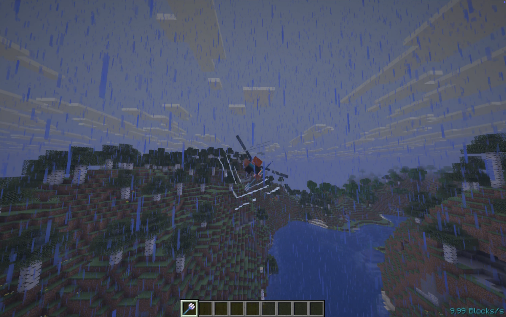

# Elytra Speed Cap

[](https://modrinth.com/mod/elytra-speed-cap)
[](https://modrinth.com/mod/elytra-speed-cap)
[](https://modrinth.com/mod/elytra-speed-cap)

A lightweight mod that **limits the maximum speed of elytra flight** to a configurable value.

Works in both **singleplayer** and on a dedicated **server**, with an optional client-side mod that offers additional improvements for players.

> Ideal for multiplayer servers that want to **nerf elytra rushing**, **reduce chunk-loading lag**, or **balance late-game travel**.

## Why Use This Mod?

1. **Performance Boost**:
   Prevents high-speed elytra flight from overwhelming your server's chunk loader while being designed to be very lightweight.
2. **Comprehensive Coverage**:
   Works with every kind of boosting: Vertical boosting, rocket boosting and event when boosting your flight via a channeling trident.
3. **Fairness**:
   Makes fast travel more balanced without disabling elytras altogether.
4. **Flexible**:
   The server-side mod prevents all players, including those without it, from flying faster than the configured speed, allowing vanilla setups to join seamlessly. The client-side mod enhances the flying experience, making it smoother.
5. **Compatible**:
   It's fully compatible with modded setups right out of the box. Like for example, the popular mod **Do a Barrel Roll**.

## How It Works

Minecraft calculates elytra flight **server-side**, while the client predicts motion **locally**.
To enforce a maximum speed cap:

- **Server Side**:
  Caps player velocity when exceeding the configured speed.
- **Client Side (optional)**:
  Syncs the flight prediction to prevent visual stutter or lagging back.

> **Note**:
> Without the mod on the client, players might snap back (lag back) because the server corrects their velocity when exceeding the cap.
> Server owners should encourage players to install the mod for a smoother experience.

## Configuration

A config file is created at:

```sh
./config/elytra-speed-cap.json
```

Default contents:

```json
{
  "max_speed": 60.0
}
```

- `max_speed`: Maximum allowed elytra speed in **blocks per second**.
- After editing, **restart the server/game** to apply changes.

## Showcase

The max speed is set to 10 blocks per second.

> **Rocket Boosting**
>
> 

> **Channeling Trident**
>
> 

## Contributing & Issues

I warmly welcome:

- Bug reports
- Feature requests
- Pull requests

Please open issues or PRs on [GitHub](https://github.com/nwrenger/elytra-speed-cap/issues).

## License

This project is licensed under the **MIT License**. See [LICENSE](https://github.com/nwrenger/elytra-speed-cap/blob/main/LICENSE) for details.
